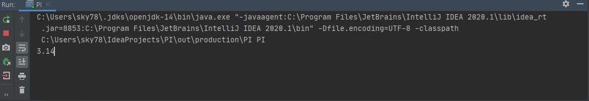
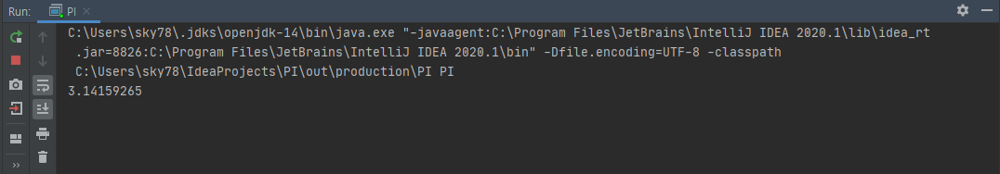

# 근사 알고리즘 java code

원주율의 값을 구하는 데 있어 많은 방식과 공식들이 있습니다.

원과 사각형의 넓이를 이용해 구하는 몬테카를로 방식이나, 무한급수의 성질을 이용한 라이프니츠 공식 등등 수많은 방법이 있는데, 저는 라이프니츠 공식을 이용하여 구현해 봤습니다.

라이프 니츠 공식은 아래 사진과 같습니다.


즉 위에 식에서 양변에 4만 곱해주면 원주율에 대한 근사값이 나오는데, 이를 java 코드로 구현하면

```java
public class PI {
    public static void main(String args[]){
      double pi=0;
      double bm=1;
      double pm=1;
      int i=0,sub=3,mul=10,sosu=0;
      System.out.print("3.");
      for(i=0;i<Integer.MAX_VALUE;i++){
          pi=pi+((1/bm)*pm);
          bm=bm+2;
          pm=pm*(-1);

          if(i==Integer.MAX_VALUE-1){
                i=0;
                sosu= (int) ((4*pi*mul-sub*10));
                sub=(int)(4*pi*mul);
                mul=mul*10;
                System.out.print(sosu);
          }
      }


    }
}
```

이렇게 나옵니다. 이에 따른 결과는 



이렇게 나오며 시간이 지난 후에는 이렇게 나오게 됩니다.

